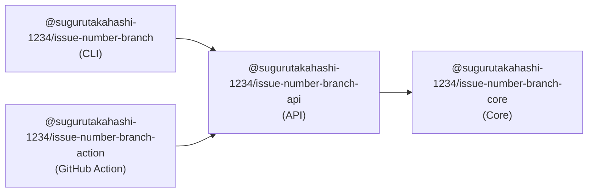

# issue-number-branch

Validate Git branch names against GitHub issue numbers.

## Installation

### CLI

```bash
# npm
npm install -g @sugurutakahashi-1234/issue-number-branch

# bun
bun add -g @sugurutakahashi-1234/issue-number-branch
```

### GitHub Action

Add to your workflow:

```yaml
- uses: sugurutakahashi-1234/issue-number-branch@v1
```

## Usage

### CLI

Check if your current branch name contains a valid GitHub issue number:

```bash
issue-number-branch
```

With options:

```bash
# Check specific branch
issue-number-branch --branch feat/issue-123

# Check specific repository
issue-number-branch --repo owner/repo

# Exclude branches from validation
issue-number-branch --exclude-pattern '{main,master,develop}'

# Filter by issue status
issue-number-branch --issue-status open
```

### GitHub Action

Add to `.github/workflows/validate-branch.yml`:

```yaml
name: Validate Branch Name

on:
  pull_request:
    types: [opened, synchronize]

jobs:
  check-branch:
    runs-on: ubuntu-latest
    steps:
      - uses: actions/checkout@v4
      
      - uses: sugurutakahashi-1234/issue-number-branch@v1
        with:
          # Optional: exclude pattern (default: '{main,master,develop}')
          exclude-pattern: '{main,master,develop,release/*}'
          
          # Optional: issue status (default: 'all')
          issue-status: 'open'
          
          # Optional: GitHub token (default: github.token)
          github-token: ${{ secrets.GITHUB_TOKEN }}
```

## Options

| Option | Description | Default |
|--------|-------------|---------|
| `--branch` / `branch` | Branch name to check | Current branch |
| `--repo` / `repo` | Repository (owner/repo format) | Current repository |
| `--exclude-pattern` / `exclude-pattern` | Glob pattern to exclude branches | `{main,master,develop}` |
| `--issue-status` / `issue-status` | Filter by issue status (all/open/closed) | `all` |
| `--github-token` / `github-token` | GitHub token for API access | `GITHUB_TOKEN` env |

### Exclude Pattern Examples

- `'{main,master,develop}'` - Exclude specific branches
- `'release/*'` - Exclude with wildcard
- `'{release,hotfix}/*'` - Exclude multiple prefixes
- `'!(feature|bugfix)/*'` - Exclude all except these

## Development

### Project Structure

This is a monorepo project with the following packages:



### Setup

```bash
# Install dependencies
bun install

# Build all packages
bun run build

# Run tests
bun test

# Run CI checks
bun run ci
```

### Available Scripts

| Command | Description |
|---------|-------------|
| `bun run build` | Build all packages |
| `bun run test` | Run tests |
| `bun run ci` | Run complete CI pipeline |
| `bun run fix` | Auto-fix code style issues |
| `bun run typecheck` | Type check all packages |

### Requirements

- Node.js v20+
- Bun (latest)

## License

MIT