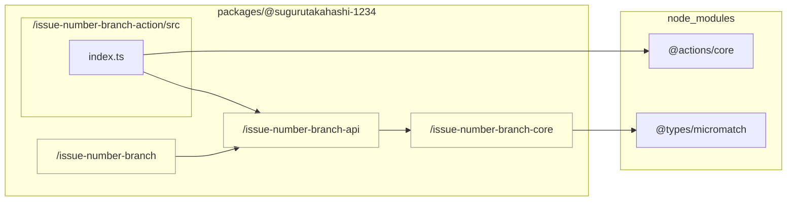

# TypeScript Graph

```bash
tsg --tsconfig ../../../tsconfig.typescript-graph.json --LR --abstraction packages/@sugurutakahashi-1234/issue-number-branch --abstraction packages/@sugurutakahashi-1234/issue-number-branch-api --abstraction packages/@sugurutakahashi-1234/issue-number-branch-core --md ../../../docs/reports/dependencies/action.md
```



