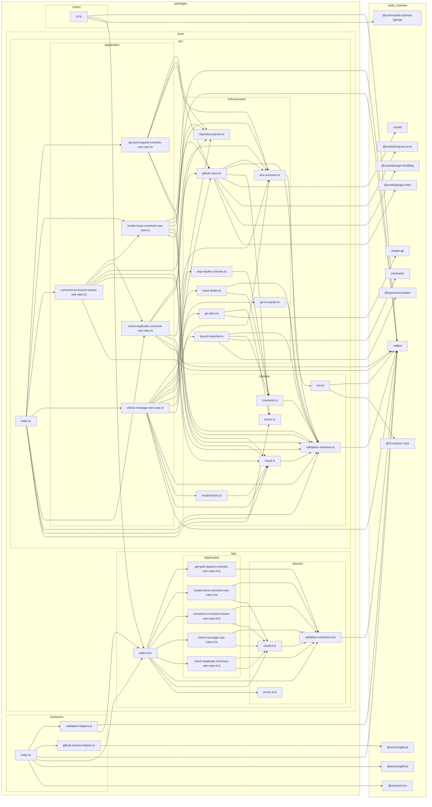

# TypeScript Graph

```bash
tsg --tsconfig tsconfig.typescript-graph.json --LR --md docs/reports/dependencies/all.md
```


```mermaid
flowchart LR
    subgraph packages["packages"]
        subgraph packages/action/src["/action/src"]
            packages/action/src/github//actions//helpers.ts["github-actions-helpers.ts"]
            packages/action/src/validation//helpers.ts["validation-helpers.ts"]
            packages/action/src/index.ts["index.ts"]
        end
        subgraph packages/core["/core"]
            subgraph packages/core/dist["/dist"]
                packages/core/dist/index.d.ts["index.d.ts"]
                subgraph packages/core/dist/domain["/domain"]
                    packages/core/dist/domain/errors.d.ts["errors.d.ts"]
                    packages/core/dist/domain/validation//schemas.d.ts["validation-schemas.d.ts"]
                    packages/core/dist/domain/result.d.ts["result.d.ts"]
                end
                subgraph packages/core/dist/application["/application"]
                    packages/core/dist/application/check//duplicate//comment//use//case.d.ts["check-duplicate-comment-use-case.d.ts"]
                    packages/core/dist/application/check//message//use//case.d.ts["check-message-use-case.d.ts"]
                    packages/core/dist/application/comment//on//branch//issues//use//case.d.ts["comment-on-branch-issues-use-case.d.ts"]
                    packages/core/dist/application/create//issue//comment//use//case.d.ts["create-issue-comment-use-case.d.ts"]
                    packages/core/dist/application/get//pull//request//commits//use//case.d.ts["get-pull-request-commits-use-case.d.ts"]
                end
            end
            subgraph packages/core/src["/src"]
                packages/core/src/index.ts["index.ts"]
                subgraph packages/core/src/domain["/domain"]
                    packages/core/src/domain/errors.ts["errors.ts"]
                    packages/core/src/domain/validation//schemas.ts["validation-schemas.ts"]
                    packages/core/src/domain/result.ts["result.ts"]
                    packages/core/src/domain/env.ts["env.ts"]
                    packages/core/src/domain/result//factory.ts["result-factory.ts"]
                    packages/core/src/domain/constants.ts["constants.ts"]
                end
                subgraph packages/core/src/infrastructure["/infrastructure"]
                    packages/core/src/infrastructure/env//accessor.ts["env-accessor.ts"]
                    packages/core/src/infrastructure/github//client.ts["github-client.ts"]
                    packages/core/src/infrastructure/repository//parser.ts["repository-parser.ts"]
                    packages/core/src/infrastructure/branch//matcher.ts["branch-matcher.ts"]
                    packages/core/src/infrastructure/git//client.ts["git-client.ts"]
                    packages/core/src/infrastructure/git//url//parser.ts["git-url-parser.ts"]
                    packages/core/src/infrastructure/issue//finder.ts["issue-finder.ts"]
                    packages/core/src/infrastructure/skip//marker//checker.ts["skip-marker-checker.ts"]
                end
                subgraph packages/core/src/application["/application"]
                    packages/core/src/application/check//duplicate//comment//use//case.ts["check-duplicate-comment-use-case.ts"]
                    packages/core/src/application/check//message//use//case.ts["check-message-use-case.ts"]
                    packages/core/src/application/create//issue//comment//use//case.ts["create-issue-comment-use-case.ts"]
                    packages/core/src/application/comment//on//branch//issues//use//case.ts["comment-on-branch-issues-use-case.ts"]
                    packages/core/src/application/get//pull//request//commits//use//case.ts["get-pull-request-commits-use-case.ts"]
                end
            end
        end
        subgraph packages/cli/src["/cli/src"]
            packages/cli/src/cli.ts["cli.ts"]
        end
    end
    subgraph node//modules["node_modules"]
        node//modules///actions/github/lib/context.d.ts["@actions/github"]
        node//modules/valibot/dist/index.d.cts["valibot"]
        node//modules///actions/core/lib/core.d.ts["@actions/core"]
        node//modules///actions/github/lib/github.d.ts["@actions/github"]
        node//modules///commander//js/extra//typings/index.d.ts["@commander-js/extra-typings"]
        node//modules///t3//oss/env//core/dist/index.d.ts["@t3-oss/env-core"]
        node//modules///octokit/plugin//retry/dist//types/index.d.ts["@octokit/plugin-retry"]
        node//modules///octokit/plugin//throttling/dist//types/index.d.ts["@octokit/plugin-throttling"]
        node//modules///octokit/request//error/dist//types/index.d.ts["@octokit/request-error"]
        node//modules/octokit/dist//types/index.d.ts["octokit"]
        node//modules///types/micromatch/index.d.ts["@types/micromatch"]
        node//modules/minimatch/dist/commonjs/index.d.ts["minimatch"]
        node//modules/simple//git/dist/typings/index.d.ts["simple-git"]
    end
    packages/action/src/github//actions//helpers.ts-->node//modules///actions/github/lib/context.d.ts
    packages/core/dist/domain/validation//schemas.d.ts-->node//modules/valibot/dist/index.d.cts
    packages/core/dist/domain/result.d.ts-->packages/core/dist/domain/validation//schemas.d.ts
    packages/core/dist/application/check//duplicate//comment//use//case.d.ts-->packages/core/dist/domain/result.d.ts
    packages/core/dist/application/check//duplicate//comment//use//case.d.ts-->packages/core/dist/domain/validation//schemas.d.ts
    packages/core/dist/application/check//message//use//case.d.ts-->packages/core/dist/domain/result.d.ts
    packages/core/dist/application/check//message//use//case.d.ts-->packages/core/dist/domain/validation//schemas.d.ts
    packages/core/dist/application/comment//on//branch//issues//use//case.d.ts-->packages/core/dist/domain/result.d.ts
    packages/core/dist/application/comment//on//branch//issues//use//case.d.ts-->packages/core/dist/domain/validation//schemas.d.ts
    packages/core/dist/application/create//issue//comment//use//case.d.ts-->packages/core/dist/domain/result.d.ts
    packages/core/dist/application/create//issue//comment//use//case.d.ts-->packages/core/dist/domain/validation//schemas.d.ts
    packages/core/dist/application/get//pull//request//commits//use//case.d.ts-->packages/core/dist/domain/validation//schemas.d.ts
    packages/core/dist/index.d.ts-->packages/core/dist/domain/errors.d.ts
    packages/core/dist/index.d.ts-->packages/core/dist/domain/result.d.ts
    packages/core/dist/index.d.ts-->packages/core/dist/domain/validation//schemas.d.ts
    packages/core/dist/index.d.ts-->packages/core/dist/application/check//duplicate//comment//use//case.d.ts
    packages/core/dist/index.d.ts-->packages/core/dist/application/check//message//use//case.d.ts
    packages/core/dist/index.d.ts-->packages/core/dist/application/comment//on//branch//issues//use//case.d.ts
    packages/core/dist/index.d.ts-->packages/core/dist/application/create//issue//comment//use//case.d.ts
    packages/core/dist/index.d.ts-->packages/core/dist/application/get//pull//request//commits//use//case.d.ts
    packages/action/src/validation//helpers.ts-->packages/core/dist/index.d.ts
    packages/action/src/validation//helpers.ts-->node//modules/valibot/dist/index.d.cts
    packages/action/src/index.ts-->node//modules///actions/core/lib/core.d.ts
    packages/action/src/index.ts-->node//modules///actions/github/lib/github.d.ts
    packages/action/src/index.ts-->packages/core/dist/index.d.ts
    packages/action/src/index.ts-->node//modules/valibot/dist/index.d.cts
    packages/action/src/index.ts-->packages/action/src/github//actions//helpers.ts
    packages/action/src/index.ts-->packages/action/src/validation//helpers.ts
    packages/cli/src/cli.ts-->node//modules///commander//js/extra//typings/index.d.ts
    packages/cli/src/cli.ts-->packages/core/dist/index.d.ts
    packages/cli/src/cli.ts-->node//modules/valibot/dist/index.d.cts
    packages/core/src/domain/validation//schemas.ts-->node//modules/valibot/dist/index.d.cts
    packages/core/src/domain/result.ts-->packages/core/src/domain/validation//schemas.ts
    packages/core/src/domain/env.ts-->node//modules///t3//oss/env//core/dist/index.d.ts
    packages/core/src/domain/env.ts-->node//modules/valibot/dist/index.d.cts
    packages/core/src/infrastructure/env//accessor.ts-->packages/core/src/domain/env.ts
    packages/core/src/infrastructure/github//client.ts-->node//modules///octokit/plugin//retry/dist//types/index.d.ts
    packages/core/src/infrastructure/github//client.ts-->node//modules///octokit/plugin//throttling/dist//types/index.d.ts
    packages/core/src/infrastructure/github//client.ts-->node//modules///octokit/request//error/dist//types/index.d.ts
    packages/core/src/infrastructure/github//client.ts-->node//modules/octokit/dist//types/index.d.ts
    packages/core/src/infrastructure/github//client.ts-->packages/core/src/domain/errors.ts
    packages/core/src/infrastructure/github//client.ts-->packages/core/src/domain/validation//schemas.ts
    packages/core/src/infrastructure/github//client.ts-->packages/core/src/infrastructure/env//accessor.ts
    packages/core/src/application/check//duplicate//comment//use//case.ts-->node//modules/valibot/dist/index.d.cts
    packages/core/src/application/check//duplicate//comment//use//case.ts-->packages/core/src/domain/result.ts
    packages/core/src/application/check//duplicate//comment//use//case.ts-->packages/core/src/domain/validation//schemas.ts
    packages/core/src/application/check//duplicate//comment//use//case.ts-->packages/core/src/infrastructure/env//accessor.ts
    packages/core/src/application/check//duplicate//comment//use//case.ts-->packages/core/src/infrastructure/github//client.ts
    packages/core/src/application/check//duplicate//comment//use//case.ts-->packages/core/src/infrastructure/repository//parser.ts
    packages/core/src/domain/result//factory.ts-->packages/core/src/domain/result.ts
    packages/core/src/domain/constants.ts-->packages/core/src/domain/validation//schemas.ts
    packages/core/src/infrastructure/branch//matcher.ts-->node//modules///types/micromatch/index.d.ts
    packages/core/src/infrastructure/branch//matcher.ts-->node//modules/minimatch/dist/commonjs/index.d.ts
    packages/core/src/infrastructure/branch//matcher.ts-->packages/core/src/domain/constants.ts
    packages/core/src/infrastructure/branch//matcher.ts-->packages/core/src/domain/validation//schemas.ts
    packages/core/src/infrastructure/git//client.ts-->node//modules/simple//git/dist/typings/index.d.ts
    packages/core/src/infrastructure/git//client.ts-->packages/core/src/domain/errors.ts
    packages/core/src/infrastructure/git//url//parser.ts-->packages/core/src/domain/validation//schemas.ts
    packages/core/src/infrastructure/issue//finder.ts-->packages/core/src/domain/constants.ts
    packages/core/src/infrastructure/issue//finder.ts-->packages/core/src/domain/validation//schemas.ts
    packages/core/src/infrastructure/skip//marker//checker.ts-->packages/core/src/domain/constants.ts
    packages/core/src/application/check//message//use//case.ts-->node//modules/valibot/dist/index.d.cts
    packages/core/src/application/check//message//use//case.ts-->packages/core/src/domain/result.ts
    packages/core/src/application/check//message//use//case.ts-->packages/core/src/domain/result//factory.ts
    packages/core/src/application/check//message//use//case.ts-->packages/core/src/domain/validation//schemas.ts
    packages/core/src/application/check//message//use//case.ts-->packages/core/src/infrastructure/branch//matcher.ts
    packages/core/src/application/check//message//use//case.ts-->packages/core/src/infrastructure/env//accessor.ts
    packages/core/src/application/check//message//use//case.ts-->packages/core/src/infrastructure/git//client.ts
    packages/core/src/application/check//message//use//case.ts-->packages/core/src/infrastructure/git//url//parser.ts
    packages/core/src/application/check//message//use//case.ts-->packages/core/src/infrastructure/github//client.ts
    packages/core/src/application/check//message//use//case.ts-->packages/core/src/infrastructure/issue//finder.ts
    packages/core/src/application/check//message//use//case.ts-->packages/core/src/infrastructure/repository//parser.ts
    packages/core/src/application/check//message//use//case.ts-->packages/core/src/infrastructure/skip//marker//checker.ts
    packages/core/src/application/create//issue//comment//use//case.ts-->node//modules/valibot/dist/index.d.cts
    packages/core/src/application/create//issue//comment//use//case.ts-->packages/core/src/domain/result.ts
    packages/core/src/application/create//issue//comment//use//case.ts-->packages/core/src/domain/validation//schemas.ts
    packages/core/src/application/create//issue//comment//use//case.ts-->packages/core/src/infrastructure/env//accessor.ts
    packages/core/src/application/create//issue//comment//use//case.ts-->packages/core/src/infrastructure/github//client.ts
    packages/core/src/application/create//issue//comment//use//case.ts-->packages/core/src/infrastructure/repository//parser.ts
    packages/core/src/application/comment//on//branch//issues//use//case.ts-->node//modules/valibot/dist/index.d.cts
    packages/core/src/application/comment//on//branch//issues//use//case.ts-->packages/core/src/domain/result.ts
    packages/core/src/application/comment//on//branch//issues//use//case.ts-->packages/core/src/domain/validation//schemas.ts
    packages/core/src/application/comment//on//branch//issues//use//case.ts-->packages/core/src/infrastructure/env//accessor.ts
    packages/core/src/application/comment//on//branch//issues//use//case.ts-->packages/core/src/application/check//duplicate//comment//use//case.ts
    packages/core/src/application/comment//on//branch//issues//use//case.ts-->packages/core/src/application/create//issue//comment//use//case.ts
    packages/core/src/application/get//pull//request//commits//use//case.ts-->node//modules/valibot/dist/index.d.cts
    packages/core/src/application/get//pull//request//commits//use//case.ts-->packages/core/src/domain/validation//schemas.ts
    packages/core/src/application/get//pull//request//commits//use//case.ts-->packages/core/src/infrastructure/env//accessor.ts
    packages/core/src/application/get//pull//request//commits//use//case.ts-->packages/core/src/infrastructure/github//client.ts
    packages/core/src/application/get//pull//request//commits//use//case.ts-->packages/core/src/infrastructure/repository//parser.ts
    packages/core/src/index.ts-->packages/core/src/domain/errors.ts
    packages/core/src/index.ts-->packages/core/src/domain/result.ts
    packages/core/src/index.ts-->packages/core/src/domain/validation//schemas.ts
    packages/core/src/index.ts-->packages/core/src/application/check//duplicate//comment//use//case.ts
    packages/core/src/index.ts-->packages/core/src/application/check//message//use//case.ts
    packages/core/src/index.ts-->packages/core/src/application/comment//on//branch//issues//use//case.ts
    packages/core/src/index.ts-->packages/core/src/application/create//issue//comment//use//case.ts
    packages/core/src/index.ts-->packages/core/src/application/get//pull//request//commits//use//case.ts
```

