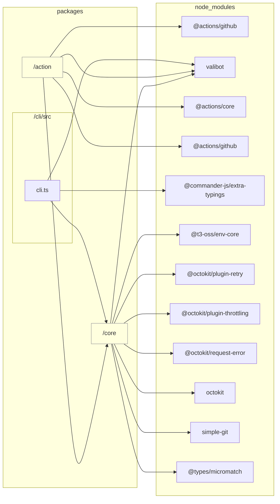

# TypeScript Graph

```bash
tsg --tsconfig ../../tsconfig.typescript-graph.json --LR --abstraction packages/action --abstraction packages/core --md ../../docs/reports/dependencies/cli.md
```


```mermaid
flowchart LR
    classDef dir fill:#0000,stroke:#999
    subgraph packages["packages"]
        packages/action["/action"]:::dir
        packages/core["/core"]:::dir
        subgraph packages/cli/src["/cli/src"]
            packages/cli/src/cli.ts["cli.ts"]
        end
    end
    subgraph node//modules["node_modules"]
        node//modules///actions/github/lib/context.d.ts["@actions/github"]
        node//modules/valibot/dist/index.d.cts["valibot"]
        node//modules///actions/core/lib/core.d.ts["@actions/core"]
        node//modules///actions/github/lib/github.d.ts["@actions/github"]
        node//modules///commander//js/extra//typings/index.d.ts["@commander-js/extra-typings"]
        node//modules///t3//oss/env//core/dist/index.d.ts["@t3-oss/env-core"]
        node//modules///octokit/plugin//retry/dist//types/index.d.ts["@octokit/plugin-retry"]
        node//modules///octokit/plugin//throttling/dist//types/index.d.ts["@octokit/plugin-throttling"]
        node//modules///octokit/request//error/dist//types/index.d.ts["@octokit/request-error"]
        node//modules/octokit/dist//types/index.d.ts["octokit"]
        node//modules/simple//git/dist/typings/index.d.ts["simple-git"]
        node//modules///types/micromatch/index.d.ts["@types/micromatch"]
    end
    packages/action-->node//modules///actions/github/lib/context.d.ts
    packages/core-->node//modules/valibot/dist/index.d.cts
    packages/action-->packages/core
    packages/action-->node//modules/valibot/dist/index.d.cts
    packages/action-->node//modules///actions/core/lib/core.d.ts
    packages/action-->node//modules///actions/github/lib/github.d.ts
    packages/cli/src/cli.ts-->node//modules///commander//js/extra//typings/index.d.ts
    packages/cli/src/cli.ts-->packages/core
    packages/cli/src/cli.ts-->node//modules/valibot/dist/index.d.cts
    packages/core-->node//modules///t3//oss/env//core/dist/index.d.ts
    packages/core-->node//modules///octokit/plugin//retry/dist//types/index.d.ts
    packages/core-->node//modules///octokit/plugin//throttling/dist//types/index.d.ts
    packages/core-->node//modules///octokit/request//error/dist//types/index.d.ts
    packages/core-->node//modules/octokit/dist//types/index.d.ts
    packages/core-->node//modules/simple//git/dist/typings/index.d.ts
    packages/core-->node//modules///types/micromatch/index.d.ts
```

