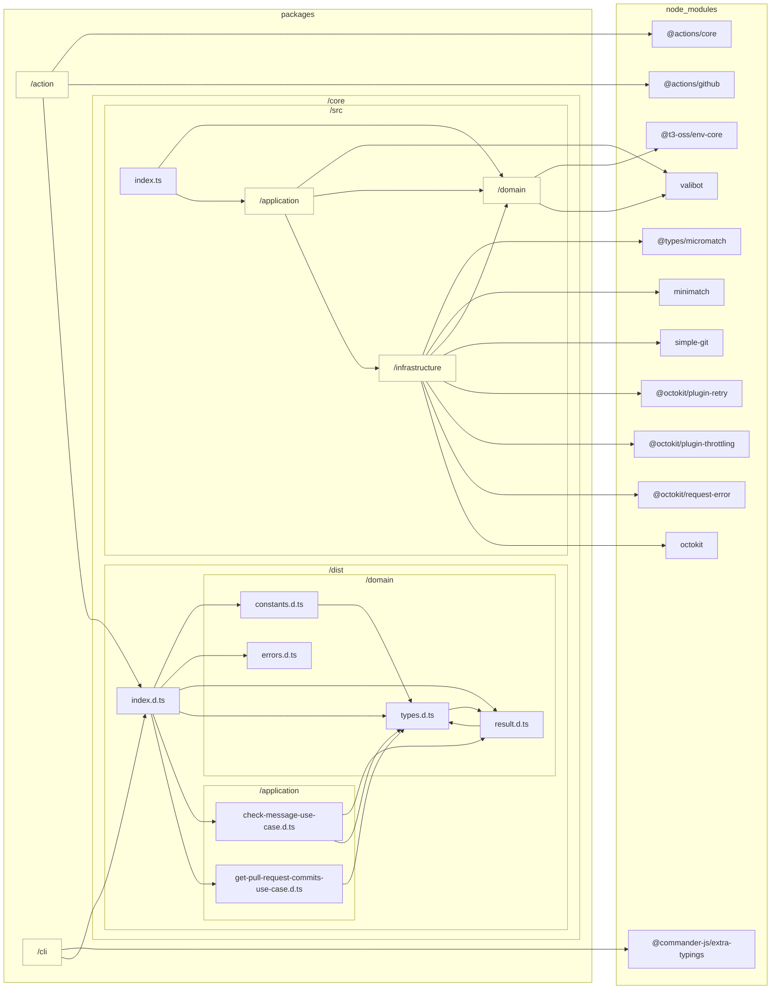

# TypeScript Graph

```bash
tsg --tsconfig ../../tsconfig.typescript-graph.json --LR --abstraction packages/cli --abstraction packages/action --abstraction src/domain --abstraction src/application --abstraction src/infrastructure --md ../../docs/reports/dependencies/core-architecture.md
```



