# TypeScript Graph

```bash
tsg --tsconfig ../../../tsconfig.typescript-graph.json --LR --abstraction packages/@sugurutakahashi-1234/issue-number-branch --abstraction packages/@sugurutakahashi-1234/issue-number-branch-action --abstraction packages/@sugurutakahashi-1234/issue-number-branch-api --md ../../../docs/reports/dependencies/core-detail.md
```

```mermaid
flowchart LR
    classDef dir fill:#0000,stroke:#999
    subgraph packages///sugurutakahashi//1234["packages/@sugurutakahashi-1234"]
        packages///sugurutakahashi//1234/issue//number//branch//api["/issue-number-branch-api"]:::dir
        packages///sugurutakahashi//1234/issue//number//branch["/issue-number-branch"]:::dir
        packages///sugurutakahashi//1234/issue//number//branch//action["/issue-number-branch-action"]:::dir
        subgraph packages///sugurutakahashi//1234/issue//number//branch//core["/issue-number-branch-core"]
            subgraph packages///sugurutakahashi//1234/issue//number//branch//core/dist["/dist"]
                packages///sugurutakahashi//1234/issue//number//branch//core/dist/index.d.ts["index.d.ts"]
                subgraph packages///sugurutakahashi//1234/issue//number//branch//core/dist/domain["/domain"]
                    packages///sugurutakahashi//1234/issue//number//branch//core/dist/domain/types.d.ts["types.d.ts"]
                    packages///sugurutakahashi//1234/issue//number//branch//core/dist/domain/constants.d.ts["constants.d.ts"]
                    packages///sugurutakahashi//1234/issue//number//branch//core/dist/domain/errors.d.ts["errors.d.ts"]
                end
                subgraph packages///sugurutakahashi//1234/issue//number//branch//core/dist/application["/application"]
                    packages///sugurutakahashi//1234/issue//number//branch//core/dist/application/check//branch//use//case.d.ts["check-branch-use-case.d.ts"]
                end
            end
            subgraph packages///sugurutakahashi//1234/issue//number//branch//core/src["/src"]
                packages///sugurutakahashi//1234/issue//number//branch//core/src/index.ts["index.ts"]
                subgraph packages///sugurutakahashi//1234/issue//number//branch//core/src/domain["/domain"]
                    packages///sugurutakahashi//1234/issue//number//branch//core/src/domain/types.ts["types.ts"]
                    packages///sugurutakahashi//1234/issue//number//branch//core/src/domain/constants.ts["constants.ts"]
                    packages///sugurutakahashi//1234/issue//number//branch//core/src/domain/errors.ts["errors.ts"]
                    packages///sugurutakahashi//1234/issue//number//branch//core/src/domain/validation//schemas.ts["validation-schemas.ts"]
                    packages///sugurutakahashi//1234/issue//number//branch//core/src/domain/env.ts["env.ts"]
                end
                subgraph packages///sugurutakahashi//1234/issue//number//branch//core/src/infrastructure["/infrastructure"]
                    packages///sugurutakahashi//1234/issue//number//branch//core/src/infrastructure/branch//matcher.ts["branch-matcher.ts"]
                    packages///sugurutakahashi//1234/issue//number//branch//core/src/infrastructure/env//accessor.ts["env-accessor.ts"]
                    packages///sugurutakahashi//1234/issue//number//branch//core/src/infrastructure/git//client.ts["git-client.ts"]
                    packages///sugurutakahashi//1234/issue//number//branch//core/src/infrastructure/git//url//parser.ts["git-url-parser.ts"]
                    packages///sugurutakahashi//1234/issue//number//branch//core/src/infrastructure/github//client.ts["github-client.ts"]
                    packages///sugurutakahashi//1234/issue//number//branch//core/src/infrastructure/issue//extractor.ts["issue-extractor.ts"]
                    packages///sugurutakahashi//1234/issue//number//branch//core/src/infrastructure/repository//parser.ts["repository-parser.ts"]
                end
                subgraph packages///sugurutakahashi//1234/issue//number//branch//core/src/application["/application"]
                    packages///sugurutakahashi//1234/issue//number//branch//core/src/application/check//branch//use//case.ts["check-branch-use-case.ts"]
                end
            end
        end
    end
    subgraph node//modules["node_modules"]
        node//modules///commander//js/extra//typings/index.d.ts["@commander-js/extra-typings"]
        node//modules///actions/core/lib/core.d.ts["@actions/core"]
        node//modules/valibot/dist/index.d.cts["valibot"]
        node//modules///types/micromatch/index.d.ts["@types/micromatch"]
        node//modules///t3//oss/env//core/dist/index.d.ts["@t3-oss/env-core"]
        node//modules/simple//git/dist/typings/index.d.ts["simple-git"]
        node//modules///octokit/plugin//retry/dist//types/index.d.ts["@octokit/plugin-retry"]
        node//modules///octokit/plugin//throttling/dist//types/index.d.ts["@octokit/plugin-throttling"]
        node//modules///octokit/request//error/dist//types/index.d.ts["@octokit/request-error"]
        node//modules/octokit/dist//types/index.d.ts["octokit"]
    end
    packages///sugurutakahashi//1234/issue//number//branch//core/dist/domain/constants.d.ts-->packages///sugurutakahashi//1234/issue//number//branch//core/dist/domain/types.d.ts
    packages///sugurutakahashi//1234/issue//number//branch//core/dist/application/check//branch//use//case.d.ts-->packages///sugurutakahashi//1234/issue//number//branch//core/dist/domain/types.d.ts
    packages///sugurutakahashi//1234/issue//number//branch//core/dist/index.d.ts-->packages///sugurutakahashi//1234/issue//number//branch//core/dist/domain/constants.d.ts
    packages///sugurutakahashi//1234/issue//number//branch//core/dist/index.d.ts-->packages///sugurutakahashi//1234/issue//number//branch//core/dist/domain/errors.d.ts
    packages///sugurutakahashi//1234/issue//number//branch//core/dist/index.d.ts-->packages///sugurutakahashi//1234/issue//number//branch//core/dist/domain/types.d.ts
    packages///sugurutakahashi//1234/issue//number//branch//core/dist/index.d.ts-->packages///sugurutakahashi//1234/issue//number//branch//core/dist/application/check//branch//use//case.d.ts
    packages///sugurutakahashi//1234/issue//number//branch//api-->packages///sugurutakahashi//1234/issue//number//branch//core/dist/index.d.ts
    packages///sugurutakahashi//1234/issue//number//branch-->node//modules///commander//js/extra//typings/index.d.ts
    packages///sugurutakahashi//1234/issue//number//branch-->packages///sugurutakahashi//1234/issue//number//branch//api
    packages///sugurutakahashi//1234/issue//number//branch//action-->node//modules///actions/core/lib/core.d.ts
    packages///sugurutakahashi//1234/issue//number//branch//action-->packages///sugurutakahashi//1234/issue//number//branch//api
    packages///sugurutakahashi//1234/issue//number//branch//core/src/domain/constants.ts-->packages///sugurutakahashi//1234/issue//number//branch//core/src/domain/types.ts
    packages///sugurutakahashi//1234/issue//number//branch//core/src/domain/validation//schemas.ts-->node//modules/valibot/dist/index.d.cts
    packages///sugurutakahashi//1234/issue//number//branch//core/src/infrastructure/branch//matcher.ts-->node//modules///types/micromatch/index.d.ts
    packages///sugurutakahashi//1234/issue//number//branch//core/src/infrastructure/branch//matcher.ts-->packages///sugurutakahashi//1234/issue//number//branch//core/src/domain/types.ts
    packages///sugurutakahashi//1234/issue//number//branch//core/src/domain/env.ts-->node//modules///t3//oss/env//core/dist/index.d.ts
    packages///sugurutakahashi//1234/issue//number//branch//core/src/domain/env.ts-->node//modules/valibot/dist/index.d.cts
    packages///sugurutakahashi//1234/issue//number//branch//core/src/infrastructure/env//accessor.ts-->packages///sugurutakahashi//1234/issue//number//branch//core/src/domain/env.ts
    packages///sugurutakahashi//1234/issue//number//branch//core/src/infrastructure/git//client.ts-->node//modules/simple//git/dist/typings/index.d.ts
    packages///sugurutakahashi//1234/issue//number//branch//core/src/infrastructure/git//client.ts-->packages///sugurutakahashi//1234/issue//number//branch//core/src/domain/errors.ts
    packages///sugurutakahashi//1234/issue//number//branch//core/src/infrastructure/git//url//parser.ts-->packages///sugurutakahashi//1234/issue//number//branch//core/src/domain/types.ts
    packages///sugurutakahashi//1234/issue//number//branch//core/src/infrastructure/github//client.ts-->node//modules///octokit/plugin//retry/dist//types/index.d.ts
    packages///sugurutakahashi//1234/issue//number//branch//core/src/infrastructure/github//client.ts-->node//modules///octokit/plugin//throttling/dist//types/index.d.ts
    packages///sugurutakahashi//1234/issue//number//branch//core/src/infrastructure/github//client.ts-->node//modules///octokit/request//error/dist//types/index.d.ts
    packages///sugurutakahashi//1234/issue//number//branch//core/src/infrastructure/github//client.ts-->node//modules/octokit/dist//types/index.d.ts
    packages///sugurutakahashi//1234/issue//number//branch//core/src/infrastructure/github//client.ts-->packages///sugurutakahashi//1234/issue//number//branch//core/src/domain/errors.ts
    packages///sugurutakahashi//1234/issue//number//branch//core/src/infrastructure/github//client.ts-->packages///sugurutakahashi//1234/issue//number//branch//core/src/domain/types.ts
    packages///sugurutakahashi//1234/issue//number//branch//core/src/infrastructure/github//client.ts-->packages///sugurutakahashi//1234/issue//number//branch//core/src/infrastructure/env//accessor.ts
    packages///sugurutakahashi//1234/issue//number//branch//core/src/application/check//branch//use//case.ts-->node//modules/valibot/dist/index.d.cts
    packages///sugurutakahashi//1234/issue//number//branch//core/src/application/check//branch//use//case.ts-->packages///sugurutakahashi//1234/issue//number//branch//core/src/domain/constants.ts
    packages///sugurutakahashi//1234/issue//number//branch//core/src/application/check//branch//use//case.ts-->packages///sugurutakahashi//1234/issue//number//branch//core/src/domain/errors.ts
    packages///sugurutakahashi//1234/issue//number//branch//core/src/application/check//branch//use//case.ts-->packages///sugurutakahashi//1234/issue//number//branch//core/src/domain/types.ts
    packages///sugurutakahashi//1234/issue//number//branch//core/src/application/check//branch//use//case.ts-->packages///sugurutakahashi//1234/issue//number//branch//core/src/domain/validation//schemas.ts
    packages///sugurutakahashi//1234/issue//number//branch//core/src/application/check//branch//use//case.ts-->packages///sugurutakahashi//1234/issue//number//branch//core/src/infrastructure/branch//matcher.ts
    packages///sugurutakahashi//1234/issue//number//branch//core/src/application/check//branch//use//case.ts-->packages///sugurutakahashi//1234/issue//number//branch//core/src/infrastructure/env//accessor.ts
    packages///sugurutakahashi//1234/issue//number//branch//core/src/application/check//branch//use//case.ts-->packages///sugurutakahashi//1234/issue//number//branch//core/src/infrastructure/git//client.ts
    packages///sugurutakahashi//1234/issue//number//branch//core/src/application/check//branch//use//case.ts-->packages///sugurutakahashi//1234/issue//number//branch//core/src/infrastructure/git//url//parser.ts
    packages///sugurutakahashi//1234/issue//number//branch//core/src/application/check//branch//use//case.ts-->packages///sugurutakahashi//1234/issue//number//branch//core/src/infrastructure/github//client.ts
    packages///sugurutakahashi//1234/issue//number//branch//core/src/application/check//branch//use//case.ts-->packages///sugurutakahashi//1234/issue//number//branch//core/src/infrastructure/issue//extractor.ts
    packages///sugurutakahashi//1234/issue//number//branch//core/src/application/check//branch//use//case.ts-->packages///sugurutakahashi//1234/issue//number//branch//core/src/infrastructure/repository//parser.ts
    packages///sugurutakahashi//1234/issue//number//branch//core/src/index.ts-->packages///sugurutakahashi//1234/issue//number//branch//core/src/domain/constants.ts
    packages///sugurutakahashi//1234/issue//number//branch//core/src/index.ts-->packages///sugurutakahashi//1234/issue//number//branch//core/src/domain/errors.ts
    packages///sugurutakahashi//1234/issue//number//branch//core/src/index.ts-->packages///sugurutakahashi//1234/issue//number//branch//core/src/domain/types.ts
    packages///sugurutakahashi//1234/issue//number//branch//core/src/index.ts-->packages///sugurutakahashi//1234/issue//number//branch//core/src/application/check//branch//use//case.ts
```



